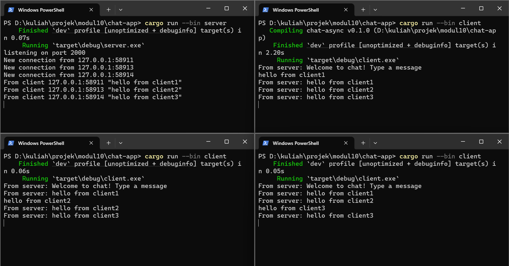

### Original code of broadcast chat, running 1 server and 3 clients

Cara menjalankannya:
- buka 4 terminal dan atur direktori ke `chat-app`
- pada terminal pertama jalankan `cargo run --bin server`
- pada tiga terminal lainnya jalankan `cargo run --bin client`

Saat kita mengetik teks di client lalu menekan Enter, `client.rs` membaca input tersebut dari `stdin` menggunakan `BufReader(...).lines()`, lalu mengirimkannya ke server sebagai pesan WebSocket melalui `ws_stream.send(Message::text(...))`. Di sisi server, setiap koneksi client ditangani oleh `handle_connection`; ketika server menerima pesan dari salah satu client, server mencetak pesan itu ke terminal server dengan format `From client ...`, lalu mengirim isi pesannya ke `broadcast channel` menggunakan `bcast_tx.send(...)`. Setiap client yang sedang terhubung memiliki `bcast_rx` masing-masing yang mendengarkan channel tersebut, sehingga pesan yang dikirim oleh satu client akan diteruskan kembali oleh server ke semua client yang subscribe, termasuk client pengirimnya sendiri. Karena itu, setelah mengetik pesan di salah satu client, pesan tersebut akan muncul di client-client sebagai `From server: ...`.

