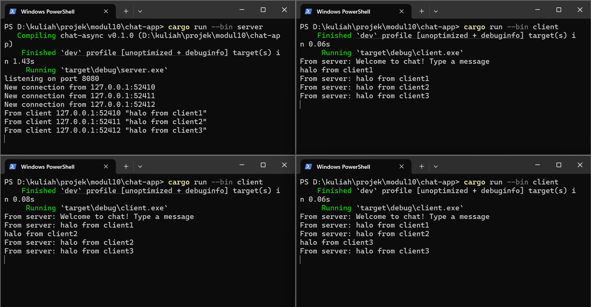
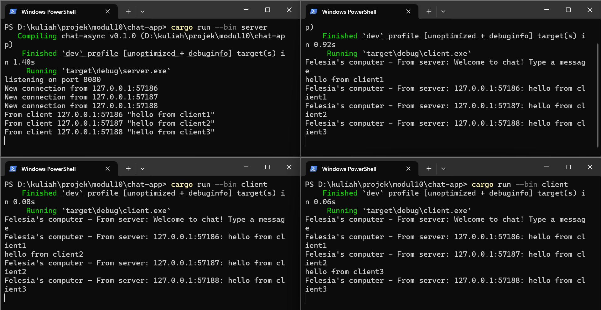

### Original code of broadcast chat, running 1 server and 3 clients

Cara menjalankannya:
- buka 4 terminal dan atur direktori ke `chat-app`
- pada terminal pertama jalankan `cargo run --bin server`
- pada tiga terminal lainnya jalankan `cargo run --bin client`

Saat kita mengetik teks di client lalu menekan Enter, `client.rs` membaca input tersebut dari `stdin` menggunakan `BufReader(...).lines()`, lalu mengirimkannya ke server sebagai pesan WebSocket melalui `ws_stream.send(Message::text(...))`. Di sisi server, setiap koneksi client ditangani oleh `handle_connection`; ketika server menerima pesan dari salah satu client, server mencetak pesan itu ke terminal server dengan format `From client ...`, lalu mengirim isi pesannya ke `broadcast channel` menggunakan `bcast_tx.send(...)`. Setiap client yang sedang terhubung memiliki `bcast_rx` masing-masing yang mendengarkan channel tersebut, sehingga pesan yang dikirim oleh satu client akan diteruskan kembali oleh server ke semua client yang subscribe, termasuk client pengirimnya sendiri. Karena itu, setelah mengetik pesan di salah satu client, pesan tersebut akan muncul di client-client sebagai `From server: ...`.

### Modifying the websocket port  

Untuk mengganti port ke `8080`, yang harus diperhatikan adalah **dua sisi koneksi**: server dan client. Di server, port ditentukan pada `TcpListener::bind("127.0.0.1:8080")`, artinya server membuka alamat lokal `127.0.0.1` pada port `8080` dan menunggu koneksi masuk. Di client, alamat tujuan ditentukan pada `ClientBuilder::from_uri(Uri::from_static("ws://127.0.0.1:8080"))`, jadi client harus mengarah ke port yang sama agar bisa terhubung ke server. Kalau server sudah memakai `8080` tetapi client masih memakai `2000`, koneksi akan gagal karena client mencari server di alamat yang berbeda. Protokol yang dipakai tetap sama, yaitu **WebSocket**, dan itu terlihat dari prefix URI `ws://` di client serta penggunaan `tokio_websockets::{ClientBuilder, ServerBuilder, WebSocketStream, Message}` di kedua sisi. Jadi port hanya menentukan “pintu” koneksi, sedangkan `ws://` dan library `tokio_websockets` menentukan bahwa komunikasi dilakukan menggunakan protokol WebSocket.

### Small changes. Add some information to client

Perubahan yang dilakukan adalah menambahkan informasi alamat pengirim pada pesan yang dikirim oleh server ke semua client. Sebelumnya, server hanya melakukan broadcast isi pesan saja, sehingga client lain hanya melihat teks chat tanpa mengetahui siapa pengirimnya. Perubahan dilakukan di bagian server karena server adalah pusat komunikasi yang menerima pesan dari setiap client dan meneruskannya ke semua client lain. Oleh karena itu, informasi `addr` yang berisi IP dan port client pengirim digabungkan dengan isi pesan sebelum dikirim melalui broadcast channel. Dengan perubahan ini, setiap pesan yang diterima client memiliki format seperti `127.0.0.1:57186: hello from client1`, sehingga setiap client dapat mengetahui dari koneksi mana pesan tersebut berasal. Perubahan ini berguna karena aplikasi chat membutuhkan identitas pengirim; meskipun belum ada sistem username, alamat IP dan port sudah cukup untuk membedakan satu client dengan client lainnya.
